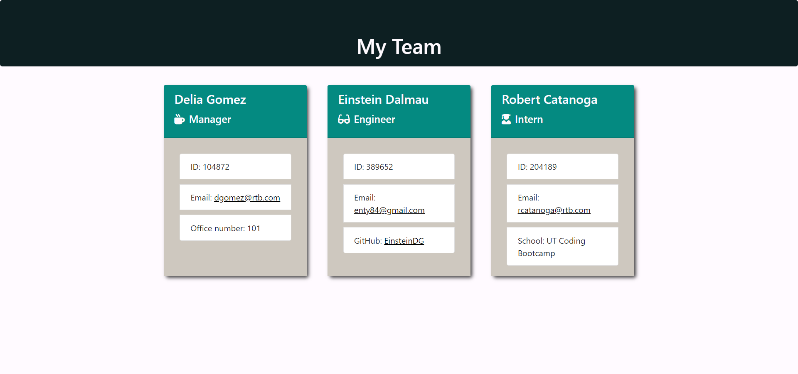

# Team Profile Generator

https://github.com/EinsteinDG/TeamProfileGenerator

## Description

This is a command line app using inquirer that takes in information about team members and creates new instances of employee classes depending on their role. Information is then rendered and spit out into an HTML employee dashboard. Classes pass 17 jest tests.

See how it works [here](./assets/profilegenerator.mp4/)

## How to use

Clone this app down and run npm i, then node app.js. This will start the inquirer questions. Then go to the output folder and team.html file and display it in your browser to see all of your team members.

